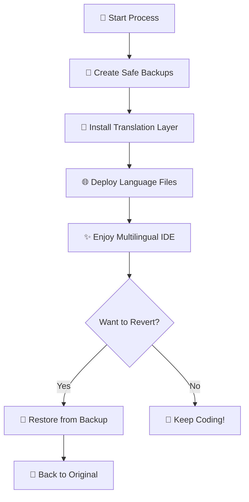

# 🌐 Cursor i18n

[](https://opensource.org/licenses/MIT)
[](https://github.com/somersby10ml/cursor-i18n)
[](https://bun.sh)
[](https://www.microsoft.com/windows/)
[](https://www.apple.com/macos/)

**Transform your Cursor IDE into a multilingual powerhouse! 🚀**

Break down language barriers and code in your native language. Cursor i18n brings seamless internationalization to your favorite IDE with just a single command.

<p align="center">
  
  
</p>

## ✨ Why Cursor i18n?

- 🚀 **One-Command Magic** – Transform your IDE in seconds
- 🛡️ **Zero Risk** – Automatic backup & recovery system
- 🌍 **Growing Language Support** – 6 languages and counting
- 💻 **Cross-Platform** – Windows & macOS ready
- 🎯 **Non-Invasive** – Clean, reversible modifications

## 🌍 Supported Languages

| Language | Code | Status |
|----------|------|--------|
| 🇪🇸 Spanish | `es-es` | ✅ Ready |
| 🇫🇷 French | `fr-fr` | ✅ Ready |
| 🇯🇵 Japanese | `ja-jp` | ✅ Ready |
| 🇰🇷 Korean | `ko-kr` | ✅ Ready |
| 🇷🇺 Russian | `ru-ru` | ✅ Ready |
| 🇨🇳 Chinese | `zh-cn` | ✅ Ready |

*More languages coming soon! Want to contribute? See our [Contributing Guide](#-contributing)*

## 🚀 Quick Start

No installation required! Use with any package manager:

```bash
# Apply translation (auto-detects your system locale)
npx cursor-i18n@latest apply

# Apply specific language
npx cursor-i18n@latest apply --lang ko-kr

# Revert to original
npx cursor-i18n@latest revert
```

**Using Bun? Replace `npx` with `bunx` for blazing fast execution! ⚡**

## 📋 Available Commands

| Command | Description | Example |
|---------|-------------|---------|
| `apply` | Apply translation to Cursor IDE | `npx cursor-i18n apply` |
| `apply --lang <code>` | Apply specific language | `npx cursor-i18n apply --lang ja-jp` |
| `revert` | Restore original Cursor interface | `npx cursor-i18n revert` |
| `list` | Show all supported languages | `npx cursor-i18n list` |
| `--help` | Display help information | `npx cursor-i18n --help` |

## 💻 Platform-Specific Usage

### 🪟 Windows Setup

```bash
# 1. Close Cursor completely (check Task Manager if needed)
# 2. Run the command
npx cursor-i18n@latest apply

# 3. Launch Cursor IDE
```

**⚠️ Important**: Ensure Cursor is completely closed before running commands!

### 🍎 macOS Setup

```bash
# 1. Open Cursor's built-in terminal
# 2. Run the command
npx cursor-i18n@latest apply

# 3. Quit Cursor completely (Cmd+Q)
# 4. Relaunch Cursor IDE
```

**💡 Pro Tip**: Use Cursor's integrated terminal for the smoothest experience!

## 🔧 How It Works

Our sophisticated approach ensures your IDE stays safe and sound:



### Under the Hood

- **🛡️ Safe Backup System** – Every file is backed up before modification
- **🎯 Protocol Interception** – Uses Electron's built-in capabilities
- **📁 Clean Architecture** – Organized file structure for easy maintenance
- **🔄 Full Reversibility** – One command to restore everything

## 🆘 Troubleshooting

**🚨 Having Issues?**

1. **First, try the basics:**
   - Close Cursor completely
   - Run `npx cursor-i18n revert`
   - Restart Cursor

2. **Still not working?**
   - Check our [FAQ Page](https://github.com/somersby10ml/cursor-i18n/wiki/FAQ)
   - Join our [Community Discussions](https://github.com/somersby10ml/cursor-i18n/discussions)

3. **Found a bug?**
   - Create an [Issue Report](https://github.com/somersby10ml/cursor-i18n/issues/new)

## ⚠️ Important Notes

- 🔄 **After Cursor Updates**: You may need to reapply translations
- 💾 **Development Mode**: Use Bun for development, any package manager for usage
- 🏢 **Enterprise Users**: Some corporate environments may have restrictions
- 🔑 **No Admin Required**: Works with standard user permissions

## 🤝 Contributing

**Help us make Cursor IDE accessible worldwide! 🌍**

### 🌐 Add a New Language

1. **Create language folder**: `lang/[locale-code]`
2. **Follow existing structure**: Check `/lang/ko-kr` or `/lang/es-es`
3. **Export your language**: Add to `/lang/lang.ts`
4. **Submit a PR**: We'll review and merge!

### 📝 Improve Translations

1. **Navigate to your language**: `cd lang/[locale-code]`
2. **Add missing translations**: Any file, any section
3. **Test thoroughly**: Apply and check the UI
4. **Share your work**: Submit a pull request

**🎯 Translation Tips:**
- Keep UI context in mind
- Maintain consistency across terms
- Test with actual usage scenarios

## 🛠️ Development Setup

```bash
# Clone the repository
git clone https://github.com/somersby10ml/cursor-i18n.git

# Install dependencies with Bun
bun install

# Build the project
bun run build

# Run locally
bun run dev
```

**Note**: While we use Bun for development, the published npm package works with any package manager!

## 📄 License

Released under the **MIT License** – see [LICENSE](LICENSE) for details.

---

<p align="center">
  <strong>Made with ❤️ for the global developer community</strong><br>
  <em>Not affiliated with Cursor or Anysphere</em>
</p>

**⭐ Star this repo if it helped you code in your language!**
