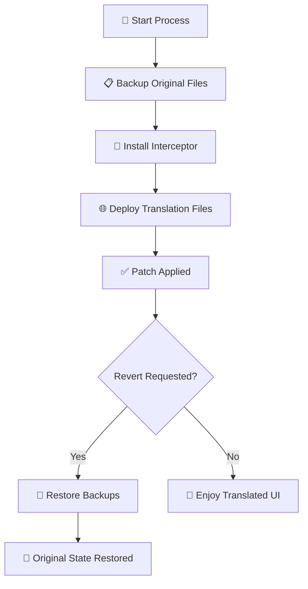

> [!WARNING]  
> Currently undergoing maintenance.

# 🌐 Cursor Translate

[](https://opensource.org/licenses/MIT)
[](https://bun.sh)
[](https://www.microsoft.com/windows/)


**Transform your Cursor IDE into a multilingual powerhouse! 🚀**

Cursor Translate brings internationalization to Cursor IDE's interface, making it accessible to developers worldwide. Say goodbye to language barriers and hello to a truly global coding experience.


## ✨ Features

- ⚡ **Simple Command Execution** - Easy one-click execution
- 🛡️ **Safe Backup & Recovery** - Complete backup system for secure restoration


## 🚀 Quick Start

### Prerequisites
- **Windows 10/11** 
- **[Cursor IDE](https://www.cursor.com)** - Latest version recommended
- **[Bun](https://bun.sh)** - Modern JavaScript runtime

### ⚡ Lightning Setup (Recommended)

```bash
# 🎯 Apply translation patch
bunx github:somersby10ml/cursor-i18n apply

# 🔄 Revert to original
bunx github:somersby10ml/cursor-i18n revert
```

### 📦 NPM Alternative

```bash
# Install globally
npm install -g cursor-i18n

# Apply patch
npx cursor-i18n apply

# Revert changes
npx cursor-i18n revert
```

## 🌍 Supported Languages

| Language | Locale Code |
|----------|-------------|
| 🇪🇸 Spanish | `es-es` |
| 🇫🇷 French | `fr-fr` |
| 🇯🇵 Japanese | `ja-jp` |
| 🇰🇷 Korean | `ko-kr` |
| 🇷🇺 Russian | `ru-ru` |
| 🇨🇳 Chinese | `zh-cn` |


## 🎯 Usage

```bash
# Apply translation
bun run apply

# Revert to original
bun run revert

# Support language list
bun run list

# Show help
bun run help
```

---

## 🔧 How It Works

Cursor Translate uses a sophisticated, non-invasive approach:



### Technical Details

1. **🔒 Safe Backup**: Creates secure backups of all modified files
2. **🎣 Protocol Interception**: Uses Electron's protocol interception for seamless translation
3. **📁 File Structure**:
   ```
   Cursor Installation/
   ├── resources/app/
   │   ├── package.json (interceptor registration)
   │   ├── package.json.backup (original backup)
   │   └── out/
   │       ├── cursorTranslatorMain.js (interceptor)
   │       └── vs/workbench/
   │           ├── workbench.desktop.main.js (original)
   │           └── workbench.desktop.main_translated.js (translated)
   ```

---


## 🛠️ Troubleshooting

<details>
<summary><b>🚨 Patch Not Working?</b></summary>

1. **Close Cursor completely**
2. **Run restore**: `bun run revert`
3. **Restart as administrator** (if needed)
4. **Reapply patch**: `bun run apply`
5. **Launch Cursor**

</details>

<details>
<summary><b>🔄 After Cursor Update</b></summary>

Cursor updates may reset the interface. Simply reapply the patch:
```bash
bunx github:somersby10ml/cursor-i18n apply
```

</details>

<details>
<summary><b>🆘 Still Having Issues?</b></summary>

- Check our [comprehensive FAQ](https://github.com/somersby10ml/cursor-i18n/wiki/FAQ)
- Join our [community discussions](https://github.com/somersby10ml/cursor-i18n/discussions)
- Create a [detailed issue report](https://github.com/somersby10ml/cursor-i18n/issues/new)

</details>

---

## ⚠️ Important Notes

- 🔄 **Cursor updates** may require reapplying the patch
- 💾 **Backup your work** before applying patches (good practice!)
- 🔑 **No admin rights** required for standard installation
- 🏢 **Enterprise environments** may have additional restrictions

---


## 📄 License

This project is licensed under the **MIT License** - see the [LICENSE](LICENSE) file for details.

**📣 Disclaimer**: This project is not officially affiliated with Cursor or Anysphere.
