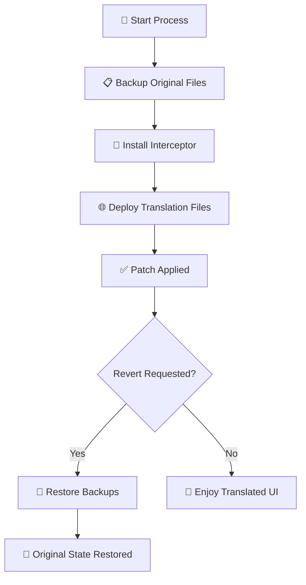

# 🌐 Cursor i18n

[](https://opensource.org/licenses/MIT)
[](https://bun.sh)
[](https://www.microsoft.com/windows/)
[](https://www.apple.com/macos/)


**Transform your Cursor IDE into a multilingual powerhouse! 🚀**

Cursor i18n localizes the Cursor IDE interface using a simple command line tool. The project is written in TypeScript and built with [Bun](https://bun.sh). The npm package ships with precompiled JavaScript so you can run it with either Bun or Node.

Use `bunx cursor-i18n` or `npx cursor-i18n` to run the latest version without a global install.


## ✨ Features

- ⚡ **Simple Commands** – `apply`, `revert` and `list`
- 🛡️ **Safe Backup & Recovery** – automatically backs up files
- 🖥️ **Windows and macOS Support** – works on Windows 10/11 and macOS
- 🌍 **Future Language Expansions** – more locales coming soon


## 🚀 Quick Start

### Prerequisites
- **Windows 10/11 or macOS**
- **[Cursor IDE](https://www.cursor.com)** – latest version recommended
- **[Bun](https://bun.sh)** – needed only if you build from source
### ⚡ Quick Setup

Run with `bunx` or `npx`:

```bash
# Apply translation using your system locale
bunx cursor-i18n@latest apply # or: npx cursor-i18n@latest apply

# Apply a specific locale
bunx cursor-i18n@latest apply --lang ko-kr # or: npx cursor-i18n@latest apply --lang ko-kr

# Revert to original
bunx cursor-i18n@latest revert # or: npx cursor-i18n@latest revert
```


You can also install globally with `npm install -g cursor-i18n`.

## 🌍 Supported Languages
| Language | Locale Code |
|----------|-------------|
| 🇪🇸 Spanish | `es-es` |
| 🇫🇷 French | `fr-fr` |
| 🇯🇵 Japanese | `ja-jp` |
| 🇰🇷 Korean | `ko-kr` |
| 🇷🇺 Russian | `ru-ru` |
| 🇨🇳 Chinese | `zh-cn` |

More languages will be added in future releases.

## 🎯 Usage

```bash
# Show supported languages
bunx cursor-i18n list

# Help
bunx cursor-i18n --help
```
Use `bunx cursor-i18n --help` to see all available commands.
---

## 🔧 How It Works

Cursor Translate uses a sophisticated, non-invasive approach:



### Technical Details

1. **🔒 Safe Backup**: Creates secure backups of all modified files
2. **🎣 Protocol Interception**: Uses Electron's protocol interception for seamless translation
3. **📁 File Structure**:
   ```
   Cursor Installation/
   ├── resources/app/
   │   ├── package.json (interceptor registration)
   │   ├── package.json.backup (original backup)
   │   └── out/
   │       ├── cursorTranslatorMain.js (interceptor)
   │       └── vs/workbench/
   │           ├── workbench.desktop.main.js (original)
   │           └── workbench.desktop.main_translated.js (translated)
   ```

---


## 🛠️ Troubleshooting

<details>
<summary><b>🚨 Patch Not Working?</b></summary>

1. **Close Cursor completely**
2. **Run restore**: `bunx cursor-i18n revert`
3. **Restart as administrator** (if needed)
4. **Reapply patch**: `bunx cursor-i18n apply`
5. **Launch Cursor**

</details>

<details>
<summary><b>🔄 After Cursor Update</b></summary>

Cursor updates may reset the interface. Simply reapply the patch:
```bash
bunx github:somersby10ml/cursor-i18n apply
```

</details>

<details>
<summary><b>🆘 Still Having Issues?</b></summary>

- Check our [comprehensive FAQ](https://github.com/somersby10ml/cursor-i18n/wiki/FAQ)
- Join our [community discussions](https://github.com/somersby10ml/cursor-i18n/discussions)
- Create a [detailed issue report](https://github.com/somersby10ml/cursor-i18n/issues/new)

</details>

---

## ⚠️ Important Notes

- 🔄 **Cursor updates** may require reapplying the patch
- 💾 **Backup your work** before applying patches (good practice!)
- 🔑 **No admin rights** required for standard installation
- 🏢 **Enterprise environments** may have additional restrictions

---


**📣 Disclaimer**: This project is not officially affiliated with Cursor or Anysphere.

## 🤝 Contributing

We welcome contributions from the community! Help us make Cursor IDE accessible to more languages and users worldwide. 🌍

### 🌐 Adding New Languages

Want to add support for a new language? Follow these simple steps:

1. **📁 Create Language Folder**
   ```bash
   mkdir lang/[locale-code]  # e.g., lang/pt-br for Portuguese (Brazil)
   ```

2. **📋 Follow Existing Structure**
   - Reference other language folders (e.g., `/lang/ko-kr`, `/lang/es-es`)
   - Maintain the same file organization and naming conventions
   - Copy the structure and translate the content

3. **🔗 Export Your Language**
   - Add your language export to `/lang/lang.ts`
   - Follow the existing pattern for consistency

### ✏️ Adding Missing Translations

Found some untranslated text? Here's how to help:

1. **🎯 Navigate to Language Folder**
   ```bash
   cd lang/[locale-code]  # e.g., cd lang/es-es
   ```

2. **📝 Add or Update Translations**
   - Create new translation files as needed
   - Add missing translations to existing files
   - File organization is by menu categories for convenience - don't worry about perfect categorization!

3. **🧩 File Structure Guidelines**
   - Files are organized by UI sections/menus for readability
   - Feel free to add translations to any relevant file
   - The exact file doesn't matter as much as having accurate translations

### 🎨 Translation Tips

- **🎯 Keep it contextual** - Consider the UI context when translating
- **📏 Mind the length** - Some UI elements have space constraints
- **🔤 Stay consistent** - Use consistent terminology throughout
- **🧪 Test thoroughly** - Apply your translations and test the UI

### 📬 Submitting Contributions

1. Fork the repository
2. Create a feature branch (`git checkout -b add-language-[locale]`)
3. Commit your changes (`git commit -am 'Add [Language] translation'`)
4. Push to the branch (`git push origin add-language-[locale]`)
5. Create a Pull Request

**🎉 Every contribution makes Cursor IDE more accessible to developers worldwide!**

## 📄 License

This project is licensed under the **MIT License** - see the [LICENSE](LICENSE) file for details.
