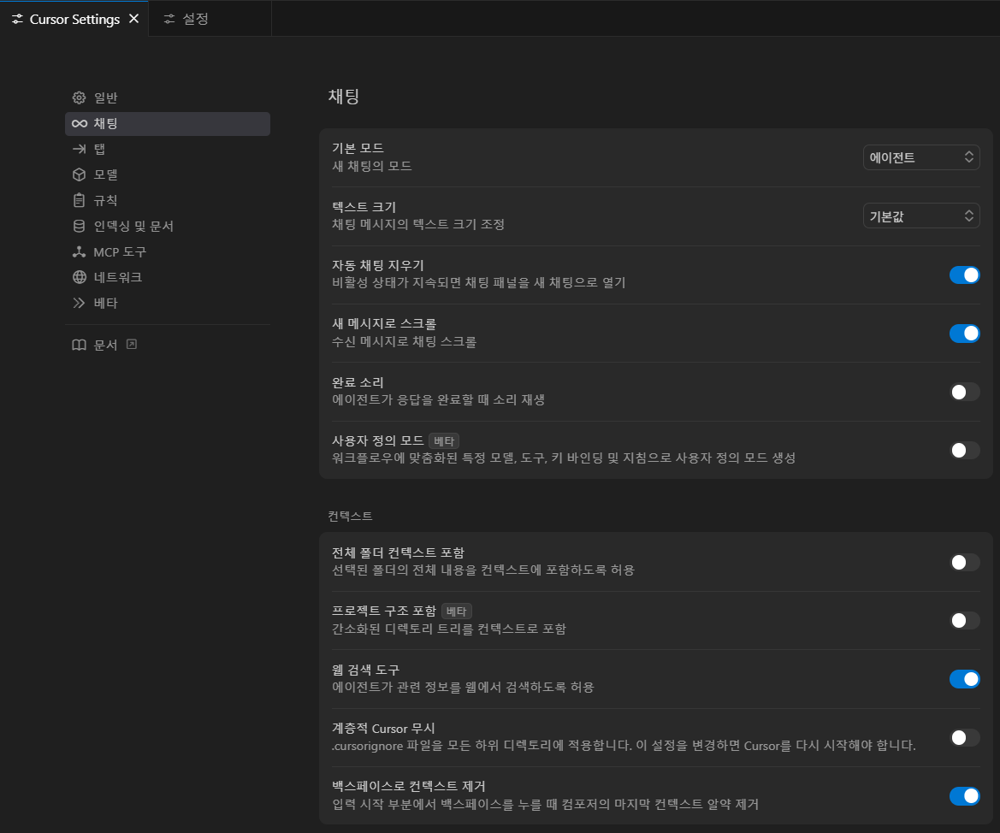
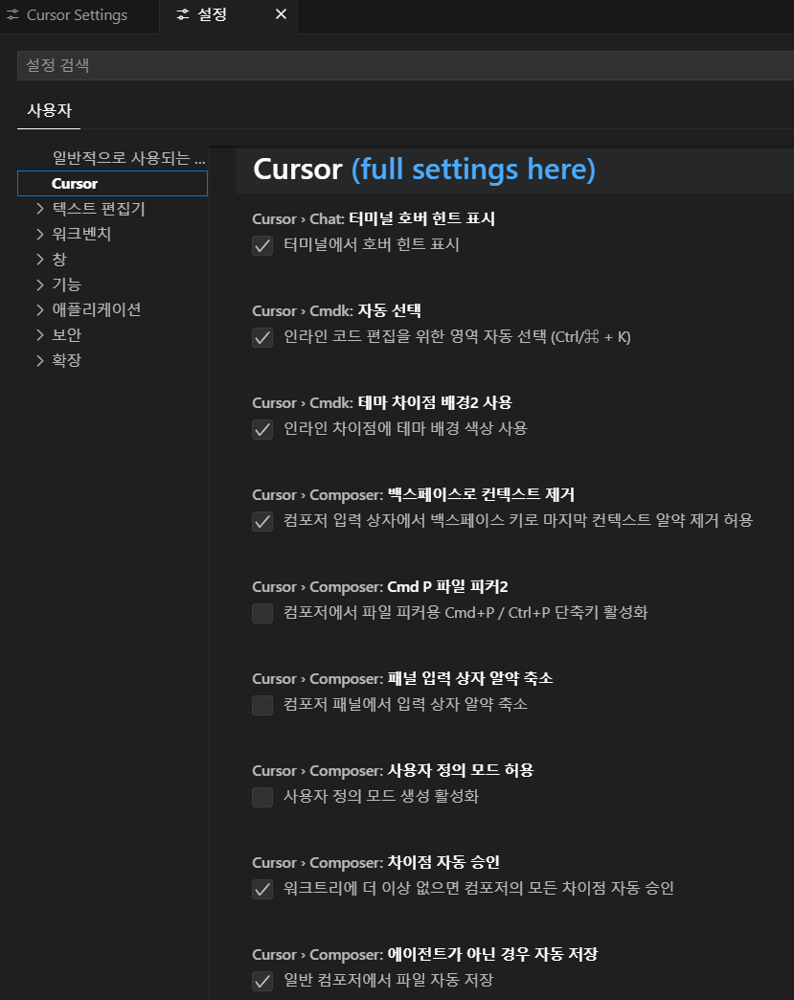

# Cursor Language Patch

Cursor IDE 설정 페이지를 한글화하기 위한 패치 프로젝트입니다.

## 주요 기능
- Cursor 설정 페이지의 텍스트를 한국어로 번역하여 적용합니다.
- `resources\app\out\vs\workbench\workbench.desktop.main.js` 파일을 직접 패치합니다.

## 설치 및 실행
```bash
bun install   # 의존성 설치
bun start     # 패치 실행 및 로컬 서버 시작
````

## 다음과 같은 환경에서 테스트 되었습니다.

* 운영체제: Windows 11 64비트
* Cursor 버전: 0.50.4 (User Setup)

## 주의사항

1. **개발 단계**: 현재 개발 중인 프로젝트입니다.
2. **파일 수정 위험**: Cursor 내부 파일을 직접 변경하므로, 문제가 발생할 경우 재설치하세요.
3. **유지보수 중단 가능성**: 언제든지 지원이 중단될 수 있습니다.
4. **윈도우 전용**: Windows 환경에서만 동작합니다.
5. 잘못 번역된 문장이 있을 수 있으므로 주의하세요.

## 이미지




## 번역 추가 방법
`/lang/ko.ts` 파일에 번역을 추가하세요.
